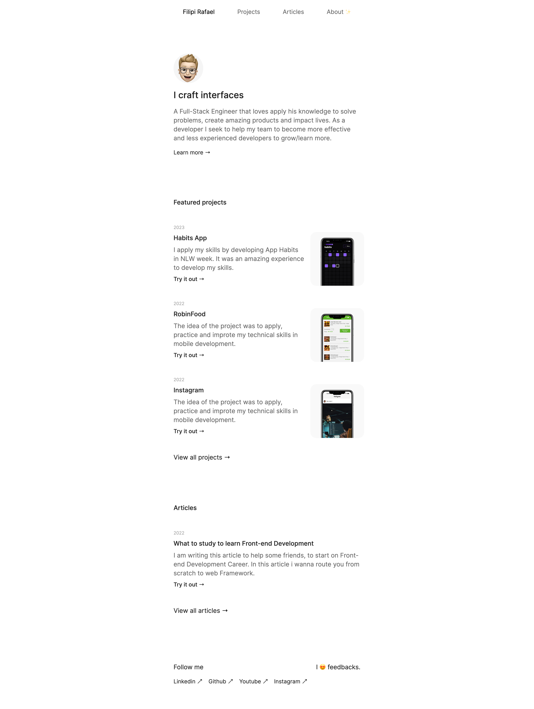

## 🚀 Sobre o Projeto

The idea of the project was to apply, practice and improve my technical skills in web development with React, and use it for portfolio and professional presentation.

## 💡 Ideia

O projeto tem o objetivo final de ser um portfólio minimalista.

## 🚀 Live Preview

Acesse o projeto: [Live Preview](https://portfolio-github-api.vercel.app/)

## 🚀 Novas versões

Conforme vou adquirindo novas habilidades, irei atualizando o projeto em novas versões. 

## 🚀 Tecnologias utilizadas

- HTML/CSS
- Javascript
- React
- Vercel
##

